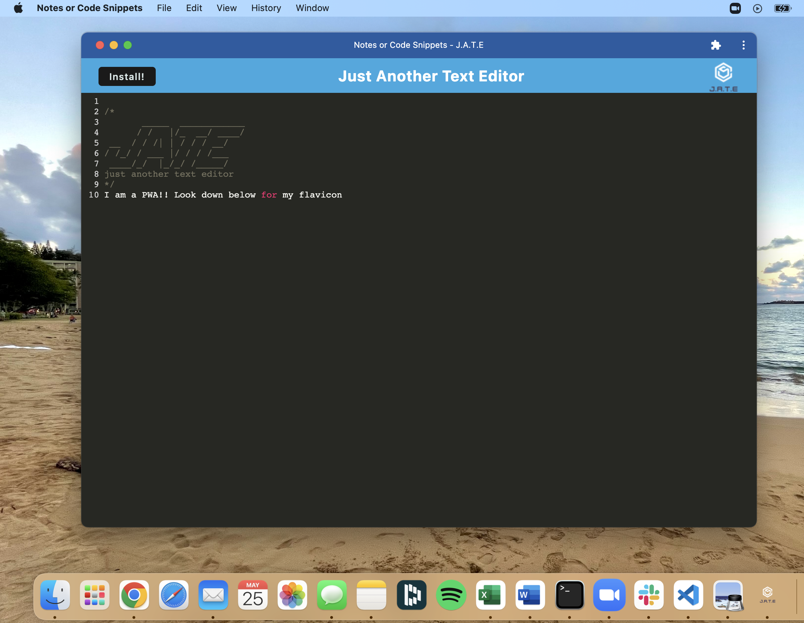

# **[PWA-Text-Editor](URL)**

## Table of Contents
---
* [License](#license)
* [Installation](#installation)
* [Packages](#packages)
* [Description](#description)
* [Usage](#usage)
* [Contributing](#contributing)
* [Questions](#questions)

 

## License 
---
[MIT License](./LICENSE)  

Copyright (c) 2022 Haley Seymour

Permission is hereby granted, free of charge, to any person obtaining a copy
of this software and associated documentation files (the "Software"), to deal
in the Software without restriction, including without limitation the rights
to use, copy, modify, merge, publish, distribute, sublicense, and/or sell
copies of the Software, and to permit persons to whom the Software is
furnished to do so, subject to the following conditions:

The above copyright notice and this permission notice shall be included in all
copies or substantial portions of the Software.

THE SOFTWARE IS PROVIDED "AS IS", WITHOUT WARRANTY OF ANY KIND, EXPRESS OR
IMPLIED, INCLUDING BUT NOT LIMITED TO THE WARRANTIES OF MERCHANTABILITY,
FITNESS FOR A PARTICULAR PURPOSE AND NONINFRINGEMENT. IN NO EVENT SHALL THE
AUTHORS OR COPYRIGHT HOLDERS BE LIABLE FOR ANY CLAIM, DAMAGES OR OTHER
LIABILITY, WHETHER IN AN ACTION OF CONTRACT, TORT OR OTHERWISE, ARISING FROM,
OUT OF OR IN CONNECTION WITH THE SOFTWARE OR THE USE OR OTHER DEALINGS IN THE
SOFTWARE.
  

 

## Installation
---
To install this project: 
1. Start by forking this repository on Github. 
2. Clone this project to your machine by using the "git clone + URL" command. 
3. Open the project with your favorite text editor, like VS Code (in your terminal, first type "cd foldername" then "code ."). 
4. Install Node.js from their website, if you have not already. Here are some additional [instructions](https://coding-boot-camp.github.io/full-stack/nodejs/how-to-install-nodejs).
6. Install [Nodemon](https://www.npmjs.com/package/nodemon).
8. This project includes a package.json file that specifies dependencies for this project, so be sure to run "npm install". This will install the packages specified in the next section. 

 

## Packages
---
Technologies: 
- Javascript
- Node.js
- Git 
- Heroku
- Webpacks
- Workbox
- Babel
- IndexedDB

NPM Packages
- express
- if-env
- nodemon 
- concurrently 
- idb

 

## Description
---
 The goal of this project is to build an Progressive Web Application with starter code for a basic text editor. This application is intended for notes or code snippets. It uses the Service Worker and Cache APIs to cache assets and API responses, which help the application run without an internet connection. It utilizes Webpack and Workbox to deliver optimized, bundled code and modular CSS. Additionally, it uses Babel transpiler to use ES6 Javascript syntax. 
 
   
Please visit this [link](URL) for the deployed application.   

## Usage
---
After following the instructions in installation: 
1. Open your root level file in your integrated terminal.
2. Use the following commands as specified in the `package.json` file: 

3. Suggest running `npm build` followed by `npm start:dev` OR `npm start`
4. Open your browser to `localhost:3000` and see me in action!
 

### **Screenshots**
--- 
Screenshot of Downloaded PWA  

 
GIF of Page Refresh  

 
GIF of Page Offline  

## Contributing 
---
This project was completed by myself, Haley Seymour, with starter code provied from the University of Washington Web Development Bootcamp. If you would like to contribute, please do and let me know if you have any questions.

 

## Questions?
---
Please contact me on Github at [hseymo](https://github.com/hseymo) or by [email](mailto:haleycseymour@comcast.net).
